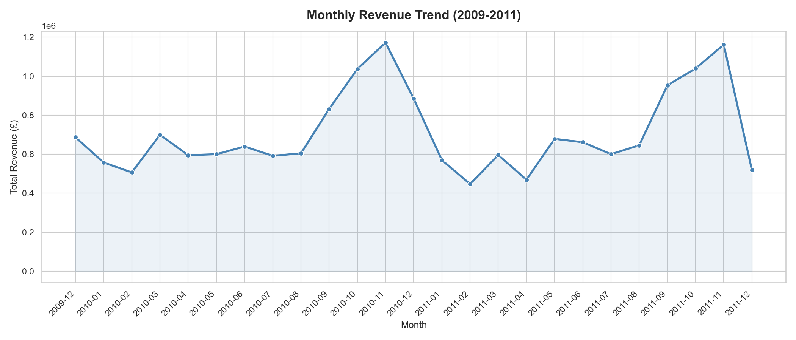
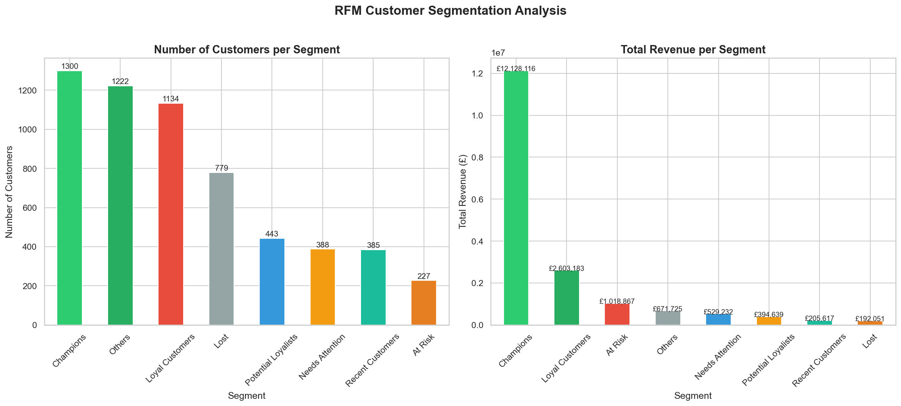
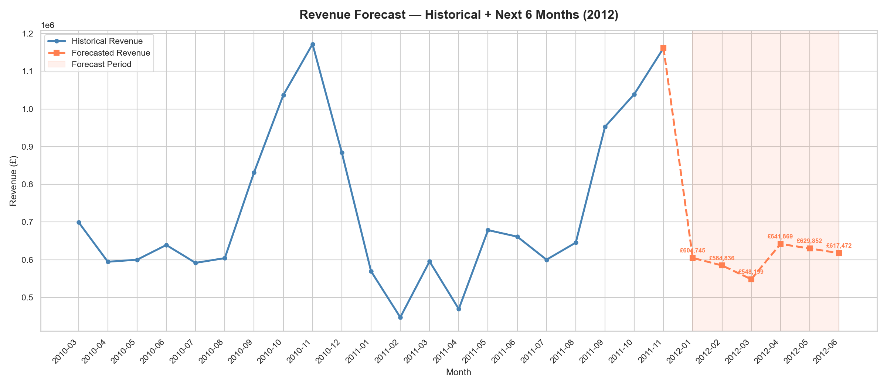

# 🛒 Retail Analytics — End-to-End Data Analytics Project

A complete end-to-end data analytics project built on a real-world retail dataset
(UCI Online Retail II — 1M+ transactions from a UK wholesale company).

Built with Python, MySQL, Machine Learning, and an interactive AI-powered dashboard.

---

## 🚀 Live Dashboard

> Run locally with `streamlit run dashboard/app.py`

---

## 📊 Project Overview

This project covers the full data analyst workflow:

| Phase               | What was done                                    |
| ------------------- | ------------------------------------------------ |
| Data Ingestion      | Loaded 805,549 cleaned transactions into MySQL   |
| SQL Analytics       | 7 business queries — revenue, trends, KPIs       |
| EDA & Visualisation | 14 charts with Pandas, Matplotlib, Seaborn       |
| RFM Segmentation    | 5,878 customers scored and segmented             |
| Cohort Analysis     | Retention heatmap across 25 monthly cohorts      |
| Basket Analysis     | Apriori algorithm — 60 product association rules |
| ML Forecasting      | Random Forest model — R²=0.707, 6-month forecast |
| AI Dashboard        | Streamlit + Gemini 2.0 Flash AI business analyst |

---

## 🔍 Key Business Insights

- 💰 **£17.7M total revenue** across 2 years (2009–2011)
- 🏆 **Champions (22% of customers) generate 68% of revenue** — Pareto principle confirmed
- 🎄 **Revenue doubles every Sep–Nov** — highly seasonal Christmas-driven business
- 🌍 **Netherlands customers spend £2,430 per order** vs UK average of £439
- 🛒 **Blue & Pink Spotty Party Candles** have a lift of 30x — strongest product association
- ⚠️ **227 At-Risk customers** represent £1M+ in potential lost revenue
- 📈 **H1 2012 forecast: £3.63M** predicted by Random Forest ML model

---

## 🛠️ Tech Stack

| Tool                          | Purpose                            |
| ----------------------------- | ---------------------------------- |
| Python 3.11                   | Core language                      |
| MySQL                         | Database storage and SQL analytics |
| Pandas / NumPy                | Data manipulation                  |
| Matplotlib / Seaborn          | Static visualisations              |
| Plotly                        | Interactive dashboard charts       |
| Scikit-learn                  | Random Forest ML model             |
| MLxtend                       | Apriori basket analysis            |
| Streamlit                     | Interactive web dashboard          |
| OpenRouter + Gemini 2.0 Flash | AI business analyst chatbot        |

---

## 📁 Project Structure

```
retail-analytics/
│
├── data/                          # Raw dataset (not uploaded — too large)
├── notebooks/
│   └── eda_analysis.ipynb         # Full EDA, RFM, cohort, basket, ML
├── sql/
│   └── analysis.sql               # All SQL business queries
├── src/
│   └── load_data.py               # ETL — Excel to MySQL pipeline
├── dashboard/
│   └── app.py                     # Streamlit dashboard with AI analyst
└── README.md
```

---

## ⚙️ How to Run

### 1. Clone the repo

```bash
git clone https://github.com/HarshShah3002/retail-analytics.git
cd retail-analytics
```

### 2. Install dependencies

```bash
pip install pandas numpy matplotlib seaborn sqlalchemy mysql-connector-python \
            scikit-learn streamlit plotly mlxtend pymysql openai python-dotenv openpyxl
```

### 3. Set up MySQL

- Create a database called `retail_analytics`
- Download the dataset from [UCI ML Repository](https://archive.ics.uci.edu/dataset/502/online+retail+ii)
- Run `python src/load_data.py` to load data into MySQL

### 4. Add your API key

Create a `.env` file:

```
OPENROUTER_API_KEY=your_key_here
```

### 5. Run the dashboard

```bash
streamlit run dashboard/app.py
```

---

## 📸 Dashboard Preview

### Sales Trends



### RFM Customer Segmentation



### Revenue Forecast



---

## 👤 Author

**Harsh Shah**  
Data Analyst | Python · SQL · Machine Learning  
[GitHub](https://github.com/HarshShah3002)

---

## 📄 Dataset

[UCI Online Retail II Dataset](https://archive.ics.uci.edu/dataset/502/online+retail+ii)  
Real transaction data from a UK-based online wholesale retailer (2009–2011)
